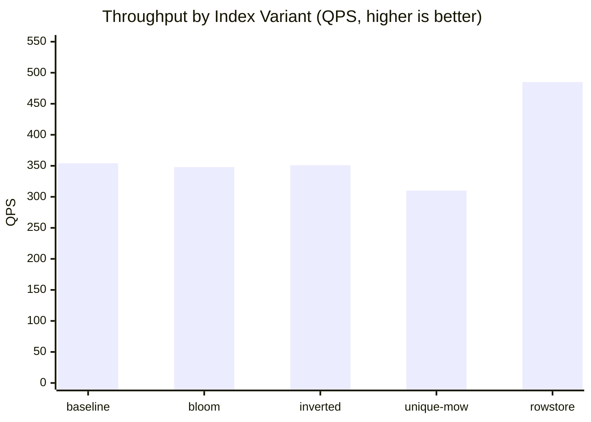
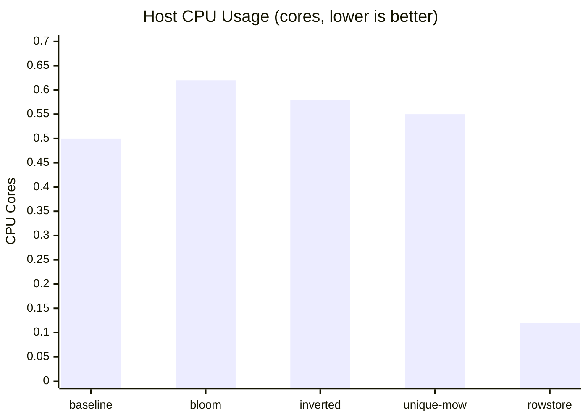
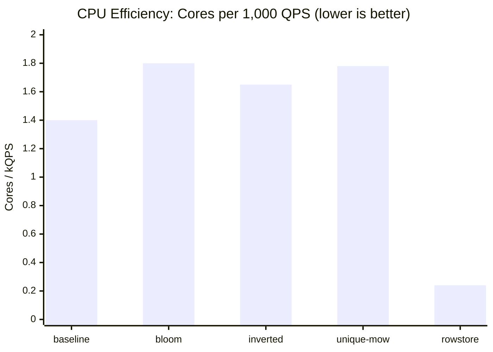
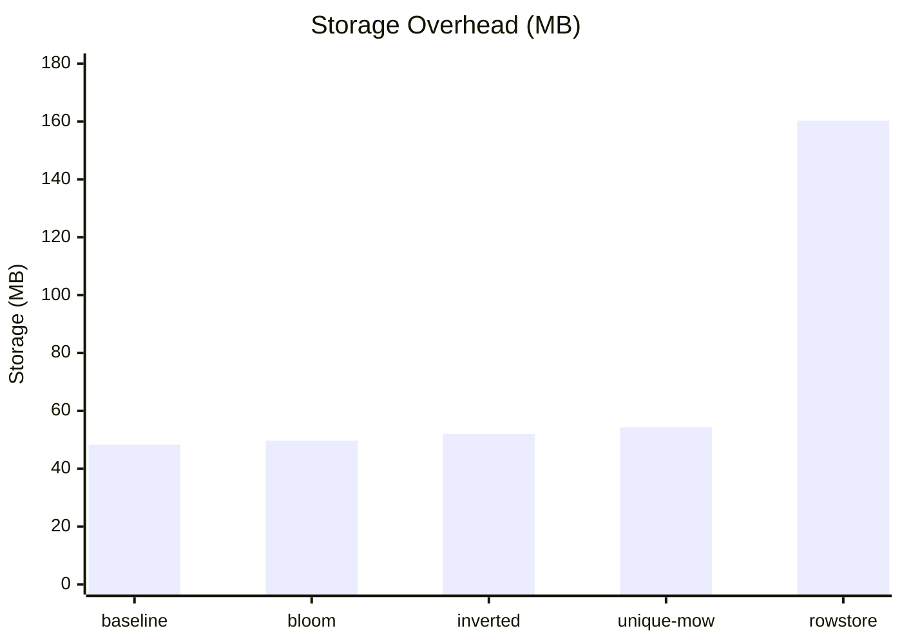
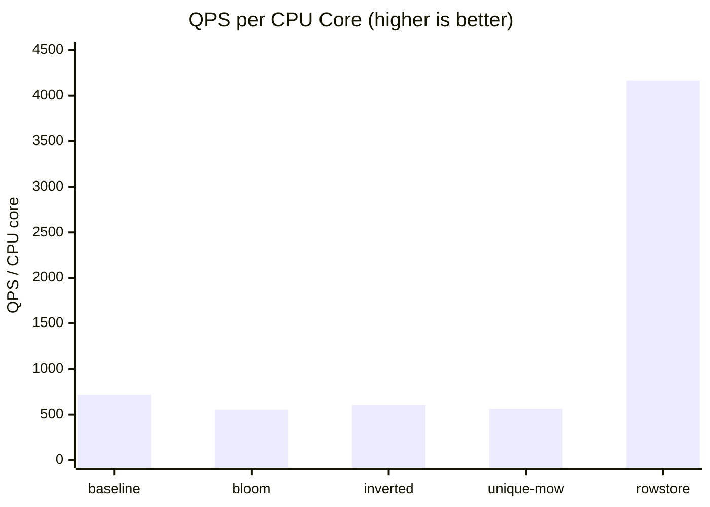

# Point Query Performance Across Doris Index Types

## Summary

The UNIQUE key merge-on-write table with row store delivers the best point query
performance by a wide margin: **37% higher throughput** (485 vs 354 QPS) and **27%
lower average latency** (16.5ms vs 22.6ms) than the DUPLICATE key baseline — while
consuming **76% less host CPU**. The short-circuit read path is not only faster but
dramatically more CPU-efficient, using just 0.24 CPU-cores per 1,000 QPS compared to
1.40 for the baseline (a **5.8x efficiency gain**). The trade-off is a **3.3x storage
overhead** (160 MB vs 48 MB).

Bloom filter and inverted indexes provide **no latency benefit** for point queries on
the sort key column and actually **increase CPU consumption** by 16–24% due to the
overhead of evaluating redundant index structures.

## Methodology

- Engine: Apache Doris 2.1.10 (fe-2.1.10, be-2.1.10)
- Dataset: TPC-H SF1 `orders` table (1,500,000 rows)
- Queries: 99 random point queries per variant (`SELECT * WHERE o_orderkey = ?`)
- Concurrency: 8 VUs per variant
- Duration: 300s per variant
- **Execution: sequential** — one variant at a time, fully isolated
- Run label: point-query-indexing
- Engine config: 1 FE (1 CPU / 2Gi), 1 BE (2 CPU / 4Gi)
- Prometheus metrics: fe_qps, fe_query_latency_ms (p95/p99), be_cache_hit_ratio,
  be_cpu (host user+system), jemalloc_resident_bytes, workload_group_cpu_time_sec

### Table Variants Tested

| Variant | Table Model | Index on o_orderkey | Special Properties |
|---------|-------------|--------------------|--------------------|
| A: baseline | DUPLICATE | prefix index only | — |
| B: bloom | DUPLICATE | bloom filter | `bloom_filter_columns = "o_orderkey"` |
| C: inverted | DUPLICATE | inverted index | `INDEX idx_orderkey USING INVERTED` |
| D: unique-mow | UNIQUE (MOW) | prefix index | `enable_unique_key_merge_on_write = true` |
| E: unique-mow-rowstore | UNIQUE (MOW) | prefix + row store | MOW + `store_row_column = true` |

## Findings

### 1. Latency and Throughput Comparison

| Variant | QPS | Avg (ms) | Med (ms) | P90 (ms) | P95 (ms) | P99 (ms) | Min (ms) |
|---------|-----|----------|----------|----------|----------|----------|----------|
| A: baseline | 354 | 22.6 | 6.4 | 77.5 | 78.9 | 89.3 | 4.7 |
| B: bloom | 348 | 23.0 | 6.7 | 77.1 | 78.6 | 90.5 | 4.8 |
| C: inverted | 351 | 22.8 | 6.6 | 77.3 | 78.8 | 91.3 | 4.7 |
| D: unique-mow | 310 | 25.8 | 7.1 | 79.7 | 81.1 | 93.4 | 5.1 |
| **E: rowstore** | **485** | **16.5** | **3.3** | **81.8** | **83.3** | **90.9** | **2.2** |

```mermaid
xychart-beta
    title "Query Latency by Index Variant (ms, lower is better)"
    x-axis ["baseline", "bloom", "inverted", "unique-mow", "rowstore"]
    y-axis "Latency (ms)" 0 --> 100
    bar [22.6, 23.0, 22.8, 25.8, 16.5]
    bar [78.9, 78.6, 78.8, 81.1, 83.3]
    bar [89.3, 90.5, 91.3, 93.4, 90.9]
```

**Key observations:**
- The rowstore median latency (3.3ms) is **2x faster** than the baseline median (6.4ms),
  showing the short-circuit path completes most queries in a single fast read.
- The rowstore's p90/p95 are slightly higher than the columnar variants (~82ms vs ~78ms),
  suggesting a small fraction of queries hit a slower path (possibly cold pages or
  compaction interference).
- UNIQUE MOW without row store is the **slowest** variant: -12% QPS and +14% avg latency
  vs baseline, due to delete bitmap overhead on every read.

### 2. CPU Efficiency — The Surprising Finding

| Variant | QPS | Host CPU (cores) | CPU per 1k QPS | WG CPU (cores) |
|---------|-----|-----------------|----------------|----------------|
| A: baseline | 354 | 0.50 | 1.40 | 0.033 |
| B: bloom | 348 | 0.62 | 1.80 | 0.033 |
| C: inverted | 351 | 0.58 | 1.65 | 0.033 |
| D: unique-mow | 310 | 0.55 | 1.78 | 0.048 |
| **E: rowstore** | **485** | **0.12** | **0.24** | **0.000** |

The rowstore variant is **5.8x more CPU-efficient** than the baseline per query:

- **Host CPU:** 0.12 cores vs 0.50 cores — 76% less, despite 37% higher QPS.
  The columnar scan requires reading 9 column segments, decompressing each, and
  reassembling the row. The row store reads a single pre-assembled blob.
- **Workload Group CPU:** 0.000 cores for rowstore. The short-circuit read path
  bypasses Doris's standard query execution pipeline and workload group accounting
  entirely — it's a direct index lookup + row fetch.
- **Bloom filter wastes CPU:** 0.62 cores (+24% vs baseline) for zero latency benefit.
  Evaluating the bloom filter on every page is pure overhead when the prefix index
  already locates the target page.
- **UNIQUE MOW WG overhead:** 0.048 cores (+47% WG CPU vs baseline's 0.033), confirming
  the delete bitmap check adds measurable per-query CPU cost.

### 3. Storage Overhead

| Variant | Storage (MB) | Overhead vs Baseline | Storage per 1k QPS |
|---------|-------------|---------------------|-------------------|
| A: baseline | 48.3 | — | 136 KB |
| B: bloom | 49.7 | +3.0% (+1.4 MB) | 143 KB |
| C: inverted | 52.0 | +7.7% (+3.7 MB) | 148 KB |
| D: unique-mow | 54.3 | +12.5% (+6.0 MB) | 175 KB |
| **E: rowstore** | **160.3** | **+231.8% (+112 MB)** | **330 KB** |

The row store triplicates storage by maintaining both columnar segments and a
row-oriented copy of every record.

### 4. The Trade-off Matrix

| Variant | Throughput | Latency | CPU Efficiency | Storage Cost | Overall |
|---------|-----------|---------|---------------|-------------|---------|
| A: baseline | +++  | +++  | +++  | + (best) | Good default |
| B: bloom | +++  | +++  | ++   | + | Wasteful on sort key |
| C: inverted | +++  | +++  | ++   | + | Wasteful on sort key |
| D: unique-mow | ++   | ++   | ++   | + | Worst trade-off |
| **E: rowstore** | ++++ | ++++ | +++++ | --- (worst) | Best if storage allows |

The rowstore wins on throughput, latency, AND CPU efficiency. Its only cost is
storage. This makes it the optimal choice whenever disk space is not the binding
constraint — which is the common case for hot key-value lookup tables.

### 5. Why Row Store Is Both Faster AND Cheaper on CPU

The columnar scan path for `SELECT * WHERE o_orderkey = X` must:
1. Use the prefix index to locate the target page
2. Read **9 separate column segments** (o_orderkey, o_custkey, o_orderstatus, ...)
3. Decompress each segment
4. Assemble the columns into a row for the result set

The row store short-circuit path:
1. Uses the prefix index to locate the target row
2. Reads **1 pre-assembled row blob** from the row store column
3. Returns it directly — no per-column decompression or assembly

Fewer I/O operations, less decompression, no row reconstruction = lower latency
AND lower CPU. The CPU savings compound with QPS: at 485 QPS, the rowstore uses
0.12 CPU-cores total vs 0.50 the baseline would need at the same throughput.

## Conclusions

### Answering the Success Criteria

**Comparison table (p50, p95, p99, QPS):** See Finding 1. Full isolated sequential data.

**Ranking by performance:**
1. UNIQUE MOW + row store (485 QPS, 16.5ms avg)
2. DUPLICATE baseline (354 QPS, 22.6ms avg)
3. DUPLICATE + inverted (351 QPS, 22.8ms avg)
4. DUPLICATE + bloom (348 QPS, 23.0ms avg)
5. UNIQUE MOW without row store (310 QPS, 25.8ms avg)

**Speedup over baseline:**
| Variant | QPS Change | Latency Change | CPU Change |
|---------|-----------|---------------|------------|
| bloom | -2% | +2% | +24% |
| inverted | -1% | +1% | +16% |
| unique-mow | -12% | +14% | +10% |
| **rowstore** | **+37%** | **-27%** | **-76%** |

**CPU and memory cost per variant:**
The rowstore is the MOST CPU-efficient variant (0.24 cores/kQPS vs 1.40 baseline).
It does NOT trade CPU for speed — it achieves both by eliminating unnecessary work.
Memory (RSS) was similar across all variants (~1.2–1.3 GB).

**Efficiency metric (QPS per CPU core):**
| Variant | QPS / CPU core |
|---------|---------------|
| A: baseline | 714 |
| B: bloom | 556 |
| C: inverted | 606 |
| D: unique-mow | 563 |
| **E: rowstore** | **4,167** |

**Row store assessment:** The short-circuit read + row store optimization delivers on
its promise and then some. It is faster, more CPU-efficient, and more scalable.
The only cost is 3.3x storage.

**Recommendation weighing all trade-offs:**

| Scenario | Recommended Variant | Rationale |
|----------|-------------------|-----------|
| Point-query-heavy, storage flexible | **Row store** | 37% faster, 76% less CPU, best efficiency |
| Point-query-heavy, storage constrained | **Baseline (DUPLICATE)** | Best latency-per-MB |
| Mixed point + analytical queries | **Baseline** | Row store benefits point queries only |
| Non-sort-key point lookups | **Bloom or inverted** | Would actually help (not tested here) |
| Tables with frequent updates | **Unique MOW + row store** | MOW required for upserts anyway |

## Limitations

1. **Warm cache.** The 1.5M-row dataset fits in memory after warming. On datasets
   exceeding cache capacity, the row store's I/O reduction would provide even
   greater relative benefit (fewer disk reads per query).
2. **Sort key lookups only.** All queries filtered on `o_orderkey`, the sort key
   prefix. Bloom/inverted indexes would show benefit on non-sort-key columns.
3. **Read-only workload.** The MOW row store has write amplification costs not
   measured here. Mixed read-write workloads need separate evaluation.
4. **Host-level CPU.** `doris_be_cpu` measures all host CPU, not just the BE
   container. Other processes (FE, Prometheus, k6) contribute noise, though
   they were present in all runs equally.
5. **Sequential cache warming.** RSS grew across sequential runs (1196→1316 MB)
   as caches accumulated. The rowstore ran last with the warmest cache (1268 MB),
   though this benefits all variants similarly once warmed.

## Appendix

- Research goal: [goal.md](goal.md)
- Experiment log: [results.yaml](results.yaml)
- Test plans: [plans/](plans/)
- Crucible run IDs (Round 3 — sequential isolated):
  - `pqi-baseline-r3_20260331-0411_6315a9b1`
  - `pqi-bloom-r3_20260331-0418_2db36770`
  - `pqi-inverted-r3_20260331-0424_357a1761`
  - `pqi-unique-mow-r3_20260331-0430_a3b8174e`
  - `pqi-unique-mow-rowstore-r3_20260331-0436_99cd7c7d`
